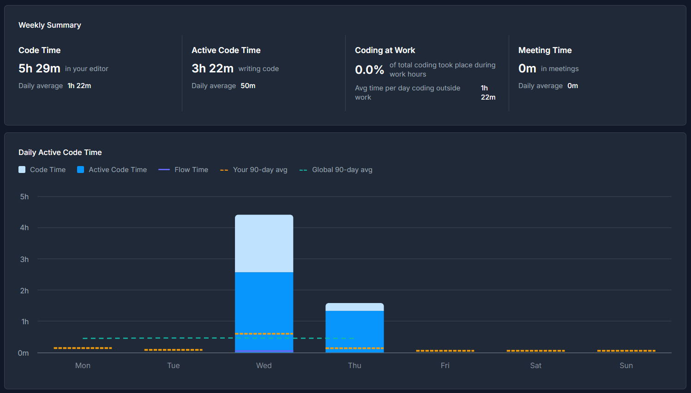
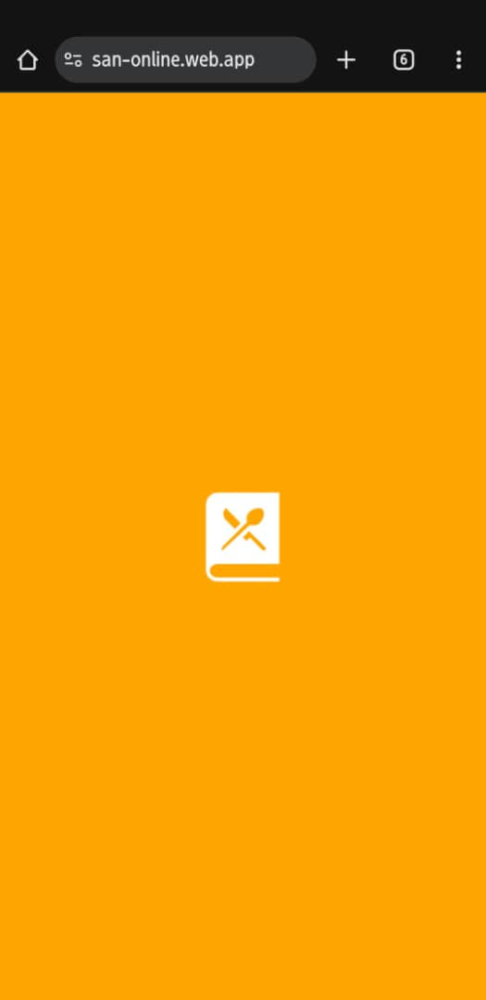
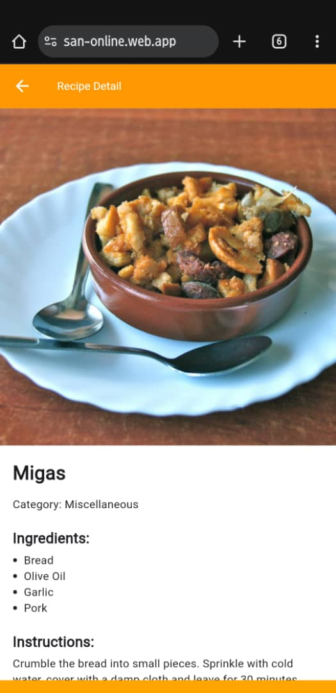
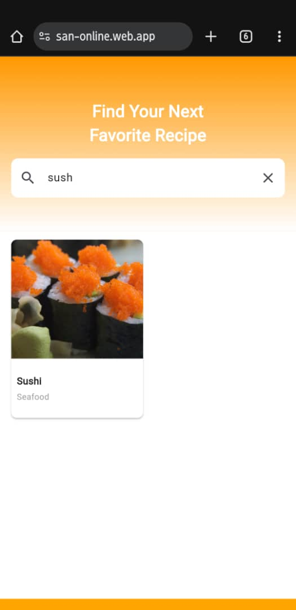
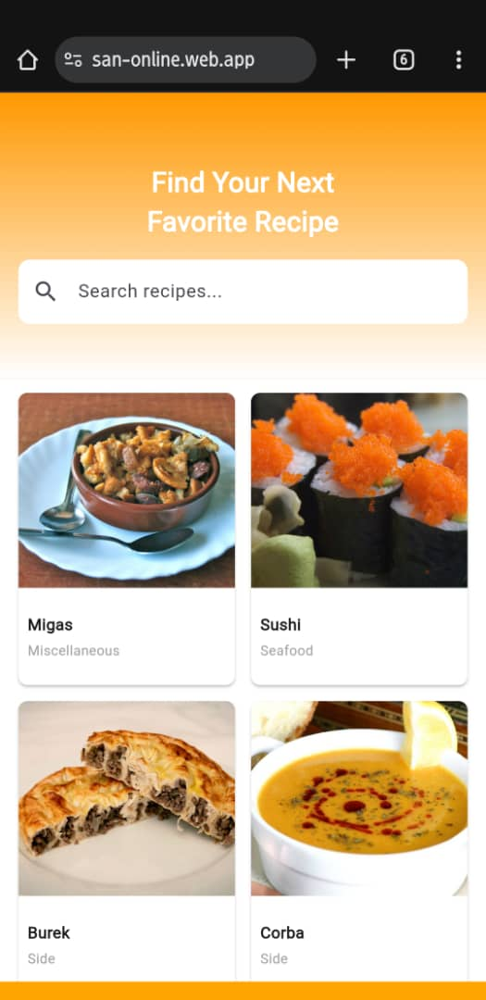
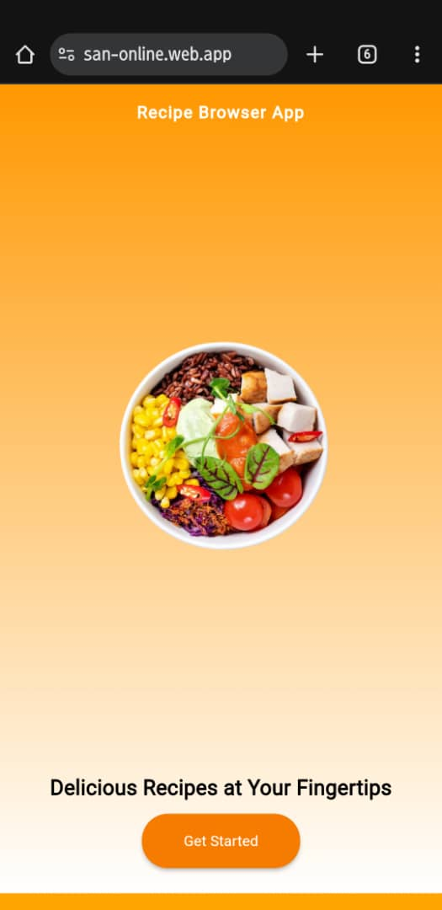

# recipe

Fintech For Kids

## Getting Started

This project is a starting point for a Flutter application.

A few resources to get you started if this is your first Flutter project:

- [Lab: Write your first Flutter app](https://docs.flutter.dev/get-started/codelab)
- [Cookbook: Useful Flutter samples](https://docs.flutter.dev/cookbook)

For help getting started with Flutter development, view the
[online documentation](https://docs.flutter.dev/), which offers tutorials,
samples, guidance on mobile development, and a full API reference.


## Features

* Browse recipes with infinite scroll (pagination) still abit shaky when it reaches the 15th item, I get snaps
* Search recipes by name
* View full recipe details including:
  * Image
  * Category
  * Ingredients
  * Cooking instructions
* Smooth navigation between list and detail pages
* Loading states and error handling


-----INSIDE LIB MAIN FOLDER
-----------------------------------
*****Core Folder
    ------INSIDE THE CORE FOLDER
    *****api Folder
        ------INSIDE THE API FOLDER
               ******meal_api.dart    
    *****models Folder
        ------INSIDE THE MODELS FOLDER
              ******recipe.dart 
    *****constants.dart file
------------------------------------
*****features Folder
      ------INSIDE THE FEATURES FOLDER
          *****recipe_detail Folder
              ------INSIDE THE RECIPE_DETAIL FOLDER
                    ******BLOC FOLDER 
                    ------INSIDE THE BLOC FOLDER
                          ******recipe_detail_bloc.dart 
                          ******recipe_detail_event.dart 
                          ******recipe_detail_state.dart 
                    ******VIEWS FOLDER 
                    ------INSIDE THE VIEWS FOLDER
                          ******recipe_detail_page.dart
                    ******WIDGETS FOLDER 
                    ------INSIDE THE WIDGETS FOLDER
                          *****ingredient_list.dart
          *****recipe_list Folder
              ------INSIDE THE RECIPE_LIST FOLDER
                    ******BLOC FOLDER 
                    ------INSIDE THE BLOC FOLDER
                          ******recipe_list_bloc.dart 
                          ******recipe_list_event.dart 
                          ******recipe_list_state.dart 
                    ******VIEWS FOLDER 
                    ------INSIDE THE VIEWS FOLDER
                          ******recipe_list_page.dart
                    ******WIDGETS FOLDER 
                    ------INSIDE THE WIDGETS FOLDER
                          *****recipe_tile.dart
--------------------------------------------------------
*****app.dart
*****constants.dart
*****firebase_options.dart
*****main.dart
*****splash_screen.dart
---------------------------------------------------------
---INSIDE THE WEB FOLDER
*****firebase-messaging-sw.js for deploying online on the url

## **Setup Instructions**

1. **Clone the repository**:


git clone <your-repo-url>
cd recipe_browser_app
```

2. **Install dependencies**:
flutter pub get


3. **Run the app**:
flutter run
flutter run -d chrome


## **Architecture Decisions**

* **BLoC** was chosen for clear separation of **UI** and **business logic**.


## **Time Spent**

Approximately **3.5 hours**:




---
## **Screenshots**





